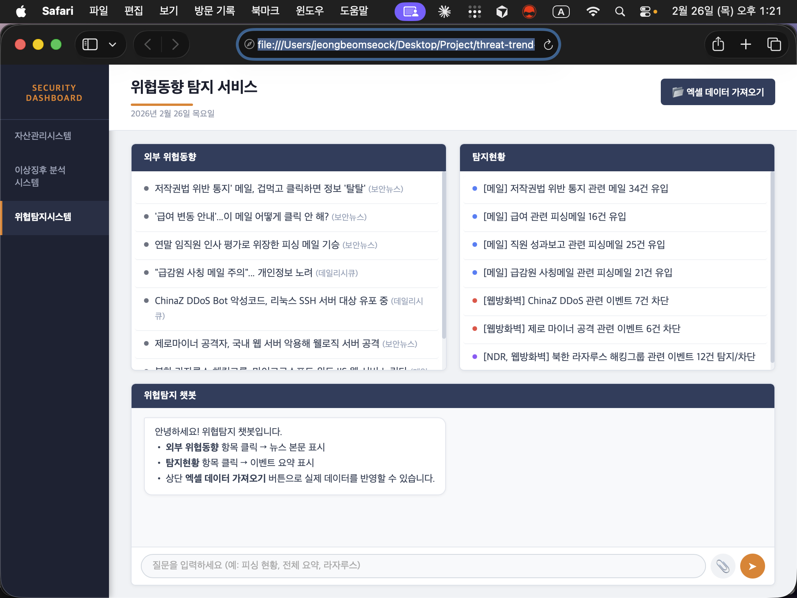

# 위협동향 탐지 서비스

외부 보안 위협동향(뉴스)과 내부 보안 로그(스팸스나이퍼 · NDR · 웹방화벽)를 연계하여 탐지 현황을 한눈에 보여주는 웹 대시보드입니다.



---

## 주요 기능

화면은 크게 세 영역으로 구성됩니다.

**외부 위협동향** 패널에는 보안뉴스, 데일리시큐 등 보안 매체에서 수집한 위협 관련 기사 목록이 표시됩니다. 항목을 클릭하면 하단 챗봇 영역에 해당 기사의 본문이 출력되며, 관련된 탐지 이벤트가 오른쪽 패널에서 자동으로 강조 표시됩니다.

**탐지현황** 패널에는 스팸스나이퍼, NDR, 웹방화벽 로그를 기사와 매칭한 결과가 표시됩니다. 메일 피싱 유입 건수, 웹방화벽 차단 이벤트, NDR 탐지 이벤트를 항목별로 확인할 수 있으며, 클릭하면 발신자·IP·탐지근거 등 상세 정보가 챗봇에 요약됩니다.

**위협탐지 챗봇**은 항목 클릭 외에도 직접 키워드를 입력해 현황을 조회할 수 있습니다. `피싱`, `웹방화벽`, `NDR`, `전체 요약` 등의 키워드를 입력하면 관련 탐지 현황을 답변합니다.

상단의 **엑셀 데이터 가져오기** 버튼으로 `.xlsx` 파일을 업로드하면 목데이터 대신 실제 데이터가 즉시 반영됩니다. 별도 서버 없이 브라우저에서 바로 동작합니다.

---

## 시작하기

별도 설치 없이 `index.html`을 브라우저에서 바로 열면 됩니다.

```bash
open index.html   # macOS
start index.html  # Windows
```

> SheetJS는 CDN으로 자동 로드됩니다. 인터넷 연결이 필요합니다.

---

## 엑셀 데이터 연동

상단의 **📂 엑셀 데이터 가져오기** 버튼으로 `.xlsx` 파일을 업로드하면 데이터가 즉시 반영됩니다.

### 매칭 방식

로그 시트에는 별도의 기사명 열이 없습니다. **뉴스기사 제목에서 추출한 키워드**를 각 로그의 지정 필드에서 검색하여 자동으로 연계합니다.

| 로그 | 키워드 검색 대상 필드 |
|------|----------------------|
| 스팸스나이퍼 | 제목(F열), 발신자(G열) |
| NDR로그 | NDR_RuleName(A열), 로그소스(C열) |
| 웹방화벽로그 | URL도메인(H열), 룰이름(M열), 패턴이름(N열), 탐지근거(P열) |

---

### 시트 구조

**`뉴스기사1`, `뉴스기사2`, ...** (시트명이 `뉴스기사`로 시작하면 자동 인식, 시트 1개 = 기사 1개)

| 열 | 항목 | 설명 |
|----|------|------|
| A1 | 전체 텍스트 | 제목·본문·출처·날짜·태그가 합쳐진 텍스트. 첫 번째 줄이 제목, 나머지가 본문으로 처리됩니다. |

---

**`스팸스나이퍼`**

| 열 | 항목 |
|----|------|
| A | 날짜 |
| B | 메일종류 |
| C | 모드 |
| D | 전송결과 |
| E | 첨부 |
| F | 제목 |
| G | 발신자 |
| H | 발신자 IP |
| I | 수신자 |
| J | 메일크기 |
| K | 필터링 정보 |
| L | 복구 날짜 |
| M | 서버 IP |
| N | Vade Engine Spamcause |

---

**`NDR로그`**

| 열 | 항목 |
|----|------|
| A | NDR_RuleName (사용자 정의) |
| B | Risk Score (사용자 정의) |
| C | 로그 소스 |
| D | 시작 시간 |
| E | 소스 IP |
| F | 소스 포트 |
| G | 대상 IP |
| H | 대상 포트 |

---

**`웹방화벽로그`**

| 열 | 항목 |
|----|------|
| A | 시간 |
| B | 클라이언트 IP (국가) |
| C | 클라이언트 포트 |
| D | Origin IP (국가) |
| E | 서버 IP |
| F | 서버 포트 |
| G | HTTP 버전 |
| H | URL 도메인 |
| I | 요청 |
| J | 요청 데이터 길이 |
| K | 응답 |
| L | 응답 데이터 길이 |
| M | 룰 이름 |
| N | 패턴 이름 |
| O | 탐지 유형 |
| P | 탐지 근거 |
| Q | OWASP 취약점 |
| R | 국정원 8대 취약점 |
| S | KISA 홈페이지 취약점 |
| T | 탐지 개수 |
| U | 메일 |
| V | 위험도 |
| W | 조치 |
| X | Transaction ID |

> 1행은 헤더(컬럼명), 2행부터 데이터를 입력합니다.

---

## 파일 구조

```
threat-trend-detection/
├── index.html              # 메인 페이지
├── css/
│   └── style.css           # 스타일
├── js/
│   ├── data.js             # 기본 목데이터
│   ├── excel.js            # 엑셀 파싱 모듈 (SheetJS)
│   └── app.js              # 렌더링 및 챗봇 로직
├── screenshots/            # UI 스크린샷
├── ui-sketches/            # UI 스케치 이미지
└── process-docs/           # 프로세스 설명 이미지
```
